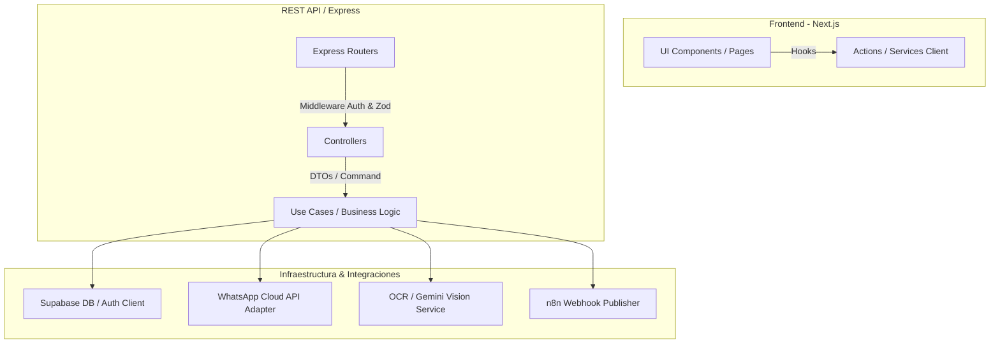

# Arquitectura del Sistema: Clean Architecture + Feature-Based Modularity

Este documento especifica la arquitectura técnica diseñada para la plataforma de Automatización de Gestión de WhatsApp Business con IA. La meta es asegurar la escalabilidad, la mantenibilidad y un acoplamiento débil entre los módulos del sistema.

---

## 1. Principios de Diseño

### Clean Architecture
Buscamos aislar la lógica de negocio central de los detalles tecnológicos (servidores, base de datos, APIs externas). La regla de dependencia establece que las dependencias de código solo pueden apuntar hacia adentro:
- **Capa de Dominio (Domain):** Entidades puras y reglas de negocio. Sin dependencias externas.
- **Capa de Aplicación (Application):** Casos de uso (Use Cases) y orquestación del flujo de datos.
- **Capa de Infraestructura (Infrastructure):** Detalles de implementación (controladores HTTP, base de datos, APIs de WhatsApp/Gemini, almacenamiento en disco).

### Feature-Based Modularity (Modularidad por Dominio)
Tanto en el frontend como en el backend, el código se agrupa por funcionalidad/dominio del negocio (p. ej., `auth`, `trips`, `clients`, `chats`, `documents`) en lugar de por rol técnico únicamente. Esto facilita el desarrollo paralelo y reduce la fricción en proyectos grandes.

---

## 2. Diagrama de Flujo y Capas



---

## 3. Estructura de Directorios del Backend

El backend se organiza en base a una estructura modular de Clean Architecture en `/backend`:

```
backend/
├── src/
│   ├── app.ts                 # Inicializador del servidor Express
│   ├── config/                # Configuraciones globales (env, supabase, etc.)
│   ├── core/                  # Elementos reutilizables en todas las capas
│   │   ├── errors/            # Excepciones personalizadas (AppError, UnauthorizedError)
│   │   └── utils/             # Funciones utilitarias globales
│   ├── domain/                # Entidades y reglas de negocio puras
│   │   ├── entities/          # Tipos y clases de dominio (Trip, Client, Message)
│   │   └── repositories/      # Interfaces de acceso a datos (IClientRepository)
│   ├── application/           # Casos de uso de negocio (Use Cases)
│   │   ├── auth/              # Casos de uso de autenticación
│   │   ├── trips/             # Casos de uso de gestión de viajes
│   │   ├── ocr/               # Flujos de extracción de documentos
│   │   └── whatsapp/          # Procesamiento de webhooks y respuestas automáticas
│   ├── infrastructure/        # Implementaciones tecnológicas
│   │   ├── controllers/       # Controladores HTTP de Express
│   │   ├── database/          # Cliente Supabase y repositorios concretos
│   │   ├── services/          # Conectores de APIs externas (Gemini, WhatsApp Cloud, n8n)
│   │   ├── middlewares/       # Validadores, autenticadores, manejadores de errores
│   │   └── routes/            # Definición de endpoints HTTP
│   └── types/                 # Declaraciones de tipos globales de TypeScript
├── Dockerfile                 # Contenedor de producción
├── package.json
└── tsconfig.json
```

### Justificación de Capas
1. **`domain/`**: Si decidimos cambiar Supabase por Postgres puro u otra base de datos, el dominio no cambia. Las interfaces definen el comportamiento y los modelos puros.
2. **`application/`**: Orquesta cómo interactúan los servicios de IA con la persistencia. Por ejemplo, el caso de uso `ProcessIncomingMessage` obtiene el historial de chat, invoca al servicio de IA para extraer parámetros, persiste el viaje y envía el mensaje de respuesta.
3. **`infrastructure/`**: Alberga los controladores Express. Si decidimos migrar a NestJS o Fastify, solo reescribimos la infraestructura de rutas y controladores, manteniendo intactos los casos de uso y la lógica de dominio.

---

## 4. Estructura de Directorios del Frontend (Next.js)

En Next.js 15/16 usamos el **App Router** configurado bajo una arquitectura feature-based dentro de la carpeta `/app` y `/src` (o raíz):

```
app/
├── globals.css                # Estilos globales y tokens CSS
├── layout.tsx                 # Root layout del sistema
├── page.tsx                   # Página de bienvenida / login
├── dashboard/                 # Panel de administración principal
│   ├── page.tsx
│   └── components/            # UI interna del dashboard
├── trips/                     # Módulo de administración de viajes
│   ├── page.tsx
│   └── components/
├── chats/                     # Centro de mensajería en tiempo real
│   ├── page.tsx
│   └── components/
└── documents/                 # Módulo de gestión y auditoría de OCR
    ├── page.tsx
    └── components/
components/                    # Componentes UI reutilizables compartidos (Design System)
  ├── ui/                      # Componentes atómicos (Button, Input, Badge, Card, Dialog)
  └── shared/                  # Componentes compuestos (Sidebar, Header, TableTemplate)
hooks/                         # Custom hooks de React globales (useAuth, useTheme)
services/                      # Clientes de API compartidos (apiClient, supabaseClient)
types/                         # Tipos globales de TypeScript compartidos
```

### Organización por Feature en el Frontend
Cada carpeta de ruta principal en `app/` (como `trips/` o `chats/`) funciona como un micro-módulo. Contiene sus propios componentes que no se comparten con el resto de la aplicación.
Si un componente se vuelve útil en más de un módulo, se promueve al directorio global `/components/shared/` o `/components/ui/` si es un elemento básico del sistema de diseño.
