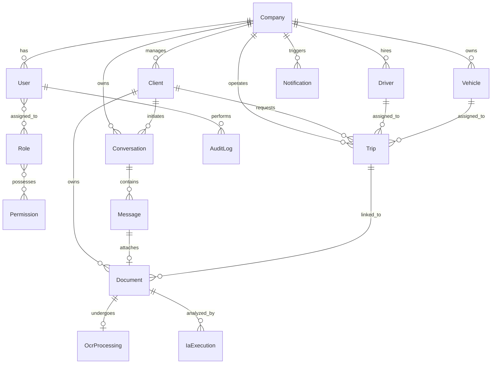

# Modelo de Base de Datos - Enterprise Scaffolding

Este documento detalla la estructura física y lógica de la base de datos PostgreSQL hospedada en Supabase para el proyecto **WhatsAppAI**, estructurada tras un riguroso proceso de diseño arquitectónico.

---

## 1. Diagrama de Relaciones Conceptual (ERD)



---

## 2. Script de Definición de Datos SQL (DDL de Producción)

Ejecuta este script en el **SQL Editor** de Supabase para inicializar la base de datos con políticas RLS de seguridad, triggers automáticos de auditoría e índices optimizados para el rendimiento de consultas a gran escala.

```sql
-- ============================================================================
-- 0. PREPARACIÓN Y EXTENSIONES
-- ============================================================================
CREATE EXTENSION IF NOT EXISTS "uuid-ossp";

-- ============================================================================
-- 1. TABLAS CORE DE TENANCY (SaaS) Y ACCESO
-- ============================================================================

-- Tabla de Empresas (Tenants)
CREATE TABLE public.companies (
    id UUID PRIMARY KEY DEFAULT gen_random_uuid(),
    name VARCHAR(255) NOT NULL,
    created_at TIMESTAMPTZ NOT NULL DEFAULT NOW(),
    updated_at TIMESTAMPTZ NOT NULL DEFAULT NOW(),
    deleted_at TIMESTAMPTZ NULL
);

-- Tabla de Usuarios (Sincronizada con auth.users de Supabase)
CREATE TABLE public.users (
    id UUID PRIMARY KEY REFERENCES auth.users(id) ON DELETE CASCADE,
    company_id UUID NOT NULL REFERENCES public.companies(id) ON DELETE CASCADE,
    email VARCHAR(255) UNIQUE NOT NULL,
    created_at TIMESTAMPTZ NOT NULL DEFAULT NOW(),
    updated_at TIMESTAMPTZ NOT NULL DEFAULT NOW(),
    deleted_at TIMESTAMPTZ NULL
);

-- RBAC: Roles
CREATE TABLE public.roles (
    id UUID PRIMARY KEY DEFAULT gen_random_uuid(),
    name VARCHAR(100) UNIQUE NOT NULL,
    description TEXT NULL,
    created_at TIMESTAMPTZ NOT NULL DEFAULT NOW(),
    updated_at TIMESTAMPTZ NOT NULL DEFAULT NOW()
);

-- RBAC: Permisos
CREATE TABLE public.permissions (
    id UUID PRIMARY KEY DEFAULT gen_random_uuid(),
    name VARCHAR(100) UNIQUE NOT NULL,
    description TEXT NULL,
    created_at TIMESTAMPTZ NOT NULL DEFAULT NOW()
);

-- RBAC: M:N Roles y Permisos
CREATE TABLE public.role_permissions (
    role_id UUID REFERENCES public.roles(id) ON DELETE CASCADE,
    permission_id UUID REFERENCES public.permissions(id) ON DELETE CASCADE,
    PRIMARY KEY (role_id, permission_id)
);

-- RBAC: M:N Usuarios y Roles
CREATE TABLE public.user_roles (
    user_id UUID REFERENCES public.users(id) ON DELETE CASCADE,
    role_id UUID REFERENCES public.roles(id) ON DELETE CASCADE,
    PRIMARY KEY (user_id, role_id)
);

-- ============================================================================
-- 2. TABLAS MAESTRAS (DIRECTORIO DE RECURSOS)
-- ============================================================================

-- Tabla de Clientes
CREATE TABLE public.clients (
    id UUID PRIMARY KEY DEFAULT gen_random_uuid(),
    company_id UUID NOT NULL REFERENCES public.companies(id) ON DELETE CASCADE,
    name VARCHAR(255) NULL,
    whatsapp_phone VARCHAR(50) NOT NULL,
    email VARCHAR(255) NULL,
    created_at TIMESTAMPTZ NOT NULL DEFAULT NOW(),
    updated_at TIMESTAMPTZ NOT NULL DEFAULT NOW(),
    deleted_at TIMESTAMPTZ NULL,
    CONSTRAINT unique_company_whatsapp UNIQUE (company_id, whatsapp_phone)
);

-- Tabla de Conductores
CREATE TABLE public.drivers (
    id UUID PRIMARY KEY DEFAULT gen_random_uuid(),
    company_id UUID NOT NULL REFERENCES public.companies(id) ON DELETE CASCADE,
    name VARCHAR(255) NOT NULL,
    phone VARCHAR(50) NULL,
    license_number VARCHAR(100) NULL,
    created_at TIMESTAMPTZ NOT NULL DEFAULT NOW(),
    updated_at TIMESTAMPTZ NOT NULL DEFAULT NOW(),
    deleted_at TIMESTAMPTZ NULL,
    CONSTRAINT unique_company_license UNIQUE (company_id, license_number)
);

-- Tabla de Vehículos
CREATE TABLE public.vehicles (
    id UUID PRIMARY KEY DEFAULT gen_random_uuid(),
    company_id UUID NOT NULL REFERENCES public.companies(id) ON DELETE CASCADE,
    plate_number VARCHAR(50) NOT NULL,
    brand VARCHAR(100) NULL,
    model VARCHAR(100) NULL,
    created_at TIMESTAMPTZ NOT NULL DEFAULT NOW(),
    updated_at TIMESTAMPTZ NOT NULL DEFAULT NOW(),
    deleted_at TIMESTAMPTZ NULL,
    CONSTRAINT unique_company_plate UNIQUE (company_id, plate_number)
);

-- ============================================================================
-- 3. TABLAS OPERATIVAS Y DE COMUNICACIÓN
-- ============================================================================

-- Tabla de Viajes
CREATE TABLE public.trips (
    id UUID PRIMARY KEY DEFAULT gen_random_uuid(),
    company_id UUID NOT NULL REFERENCES public.companies(id) ON DELETE CASCADE,
    client_id UUID NOT NULL REFERENCES public.clients(id) ON DELETE RESTRICT,
    driver_id UUID NULL REFERENCES public.drivers(id) ON DELETE SET NULL,
    vehicle_id UUID NULL REFERENCES public.vehicles(id) ON DELETE SET NULL,
    origin VARCHAR(255) NOT NULL,
    destination VARCHAR(255) NOT NULL,
    departure_date TIMESTAMPTZ NULL,
    status VARCHAR(50) NOT NULL DEFAULT 'pending' CHECK (status IN ('pending', 'confirmed', 'completed', 'cancelled')),
    price NUMERIC(12, 2) NULL,
    created_at TIMESTAMPTZ NOT NULL DEFAULT NOW(),
    updated_at TIMESTAMPTZ NOT NULL DEFAULT NOW(),
    deleted_at TIMESTAMPTZ NULL
);

-- Tabla de Conversaciones de WhatsApp
CREATE TABLE public.conversations (
    id UUID PRIMARY KEY DEFAULT gen_random_uuid(),
    company_id UUID NOT NULL REFERENCES public.companies(id) ON DELETE CASCADE,
    client_id UUID NOT NULL REFERENCES public.clients(id) ON DELETE CASCADE,
    channel VARCHAR(50) NOT NULL DEFAULT 'whatsapp',
    last_message_at TIMESTAMPTZ NULL,
    created_at TIMESTAMPTZ NOT NULL DEFAULT NOW(),
    updated_at TIMESTAMPTZ NOT NULL DEFAULT NOW()
);

-- Tabla de Mensajes
CREATE TABLE public.messages (
    id UUID PRIMARY KEY DEFAULT gen_random_uuid(),
    conversation_id UUID NOT NULL REFERENCES public.conversations(id) ON DELETE CASCADE,
    whatsapp_message_id VARCHAR(255) NULL UNIQUE,
    direction VARCHAR(20) NOT NULL CHECK (direction IN ('inbound', 'outbound')),
    text TEXT NULL,
    media_url TEXT NULL,
    media_type VARCHAR(100) NULL,
    status VARCHAR(50) NOT NULL DEFAULT 'sent' CHECK (status IN ('sent', 'delivered', 'read', 'failed')),
    error_message TEXT NULL,
    created_at TIMESTAMPTZ NOT NULL DEFAULT NOW()
);

-- Tabla de Metadatos de Documentos
CREATE TABLE public.documents (
    id UUID PRIMARY KEY DEFAULT gen_random_uuid(),
    company_id UUID NOT NULL REFERENCES public.companies(id) ON DELETE CASCADE,
    client_id UUID NOT NULL REFERENCES public.clients(id) ON DELETE CASCADE,
    trip_id UUID NULL REFERENCES public.trips(id) ON DELETE SET NULL,
    message_id UUID NULL REFERENCES public.messages(id) ON DELETE SET NULL,
    file_name VARCHAR(255) NOT NULL,
    storage_path TEXT NOT NULL,
    file_type VARCHAR(100) NOT NULL,
    file_size INTEGER NOT NULL,
    file_hash VARCHAR(64) NOT NULL,
    status VARCHAR(50) NOT NULL DEFAULT 'pending' CHECK (status IN ('pending', 'processing', 'completed', 'failed')),
    created_at TIMESTAMPTZ NOT NULL DEFAULT NOW(),
    updated_at TIMESTAMPTZ NOT NULL DEFAULT NOW(),
    deleted_at TIMESTAMPTZ NULL,
    CONSTRAINT unique_company_hash UNIQUE (company_id, file_hash)
);

-- ============================================================================
-- 4. TABLAS DE PROCESAMIENTO COGNITIVO (OCR & IA)
-- ============================================================================

-- Tabla de Historial OCR
CREATE TABLE public.ocr_processings (
    id UUID PRIMARY KEY DEFAULT gen_random_uuid(),
    document_id UUID NOT NULL UNIQUE REFERENCES public.documents(id) ON DELETE CASCADE,
    raw_text TEXT NOT NULL,
    corrected_text TEXT NULL,
    confidence NUMERIC(5, 2) NOT NULL,
    model_used VARCHAR(100) NOT NULL,
    processed_at TIMESTAMPTZ NOT NULL DEFAULT NOW()
);

-- Tabla de Ejecuciones de Inteligencia Artificial (LLMs)
CREATE TABLE public.ia_executions (
    id UUID PRIMARY KEY DEFAULT gen_random_uuid(),
    document_id UUID NOT NULL REFERENCES public.documents(id) ON DELETE CASCADE,
    prompt_template TEXT NOT NULL,
    response_raw TEXT NOT NULL,
    response_json JSONB NOT NULL,
    model_used VARCHAR(100) NOT NULL,
    input_tokens INTEGER NOT NULL DEFAULT 0,
    output_tokens INTEGER NOT NULL DEFAULT 0,
    cost NUMERIC(10, 6) NOT NULL DEFAULT 0.000000,
    execution_time_ms INTEGER NOT NULL DEFAULT 0,
    status VARCHAR(50) NOT NULL DEFAULT 'success' CHECK (status IN ('success', 'failed')),
    created_at TIMESTAMPTZ NOT NULL DEFAULT NOW()
);

-- ============================================================================
-- 5. TABLAS DE MONITOREO Y LOGS
-- ============================================================================

-- Alertas y Notificaciones internas del Dashboard
CREATE TABLE public.notifications (
    id UUID PRIMARY KEY DEFAULT gen_random_uuid(),
    company_id UUID NOT NULL REFERENCES public.companies(id) ON DELETE CASCADE,
    user_id UUID NULL REFERENCES public.users(id) ON DELETE CASCADE,
    title VARCHAR(255) NOT NULL,
    content TEXT NOT NULL,
    type VARCHAR(50) NOT NULL,
    is_read BOOLEAN NOT NULL DEFAULT FALSE,
    created_at TIMESTAMPTZ NOT NULL DEFAULT NOW()
);

-- Tabla de Logs de Auditoría Inmutables
CREATE TABLE public.audit_logs (
    id UUID PRIMARY KEY DEFAULT gen_random_uuid(),
    company_id UUID NULL REFERENCES public.companies(id) ON DELETE SET NULL,
    user_id UUID NULL REFERENCES public.users(id) ON DELETE SET NULL,
    action VARCHAR(100) NOT NULL,
    table_name VARCHAR(100) NOT NULL,
    record_id UUID NOT NULL,
    previous_values JSONB NULL,
    new_values JSONB NULL,
    ip_address VARCHAR(45) NULL,
    user_agent TEXT NULL,
    created_at TIMESTAMPTZ NOT NULL DEFAULT NOW()
);

-- ============================================================================
-- 6. ÍNDICES DE RENDIMIENTO Y ESCALABILIDAD
-- ============================================================================

-- RLS & Tenancy Performance Indexes
CREATE INDEX idx_users_company ON public.users(company_id);
CREATE INDEX idx_clients_company ON public.clients(company_id);
CREATE INDEX idx_drivers_company ON public.drivers(company_id);
CREATE INDEX idx_vehicles_company ON public.vehicles(company_id);
CREATE INDEX idx_trips_company ON public.trips(company_id);
CREATE INDEX idx_documents_company ON public.documents(company_id);
CREATE INDEX idx_conversations_company ON public.conversations(company_id);
CREATE INDEX idx_notifications_company ON public.notifications(company_id);
CREATE INDEX idx_audit_logs_company ON public.audit_logs(company_id);

-- Business Flow Optimization Indexes
CREATE INDEX idx_clients_phone_company ON public.clients(company_id, whatsapp_phone);
CREATE INDEX idx_trips_company_status_created ON public.trips(company_id, status, created_at DESC);
CREATE INDEX idx_documents_company_status ON public.documents(company_id, status);
CREATE INDEX idx_documents_hash_company ON public.documents(company_id, file_hash);
CREATE INDEX idx_messages_conversation_created ON public.messages(conversation_id, created_at DESC);
CREATE INDEX idx_audit_logs_record_created ON public.audit_logs(table_name, record_id, created_at DESC);

-- ============================================================================
-- 7. TRIGGERS AUTOMATIZADOS (UPDATED_AT Y AUDITORÍA PL/PGSQL)
-- ============================================================================

-- Función Reutilizable para campos 'updated_at'
CREATE OR REPLACE FUNCTION public.set_updated_at()
RETURNS TRIGGER AS $$
BEGIN
    NEW.updated_at = NOW();
    RETURN NEW;
END;
$$ LANGUAGE plpgsql;

-- Vinculación de Trigger set_updated_at
CREATE TRIGGER tg_companies_updated_at BEFORE UPDATE ON public.companies FOR EACH ROW EXECUTE FUNCTION public.set_updated_at();
CREATE TRIGGER tg_users_updated_at BEFORE UPDATE ON public.users FOR EACH ROW EXECUTE FUNCTION public.set_updated_at();
CREATE TRIGGER tg_roles_updated_at BEFORE UPDATE ON public.roles FOR EACH ROW EXECUTE FUNCTION public.set_updated_at();
CREATE TRIGGER tg_clients_updated_at BEFORE UPDATE ON public.clients FOR EACH ROW EXECUTE FUNCTION public.set_updated_at();
CREATE TRIGGER tg_drivers_updated_at BEFORE UPDATE ON public.drivers FOR EACH ROW EXECUTE FUNCTION public.set_updated_at();
CREATE TRIGGER tg_vehicles_updated_at BEFORE UPDATE ON public.vehicles FOR EACH ROW EXECUTE FUNCTION public.set_updated_at();
CREATE TRIGGER tg_trips_updated_at BEFORE UPDATE ON public.trips FOR EACH ROW EXECUTE FUNCTION public.set_updated_at();
CREATE TRIGGER tg_conversations_updated_at BEFORE UPDATE ON public.conversations FOR EACH ROW EXECUTE FUNCTION public.set_updated_at();
CREATE TRIGGER tg_documents_updated_at BEFORE UPDATE ON public.documents FOR EACH ROW EXECUTE FUNCTION public.set_updated_at();

-- Función Genérica y Defensiva de Auditoría PL/pgSQL
CREATE OR REPLACE FUNCTION public.audit_trigger_fn()
RETURNS TRIGGER AS $$
DECLARE
    v_old_values JSONB := NULL;
    v_new_values JSONB := NULL;
    v_company_id UUID := NULL;
    v_user_id UUID := NULL;
BEGIN
    -- Capturar datos del usuario autenticado en la sesión de Supabase Auth
    BEGIN
        v_user_id := auth.uid();
        v_company_id := (auth.jwt() -> 'user_metadata' ->> 'company_id')::uuid;
    EXCEPTION WHEN OTHERS THEN
        -- Fallback si se ejecuta fuera de una sesión de cliente Supabase
    END;

    IF (TG_OP = 'UPDATE') THEN
        v_old_values := to_jsonb(OLD);
        v_new_values := to_jsonb(NEW);
        
        IF (v_old_values ? 'company_id') THEN
            v_company_id := (v_old_values ->> 'company_id')::uuid;
        END IF;

        INSERT INTO public.audit_logs (company_id, user_id, action, table_name, record_id, previous_values, new_values)
        VALUES (v_company_id, v_user_id, 'UPDATE', TG_TABLE_NAME, OLD.id, v_old_values, v_new_values);
        RETURN NEW;
    ELSIF (TG_OP = 'INSERT') THEN
        v_new_values := to_jsonb(NEW);

        IF (v_new_values ? 'company_id') THEN
            v_company_id := (v_new_values ->> 'company_id')::uuid;
        END IF;

        INSERT INTO public.audit_logs (company_id, user_id, action, table_name, record_id, previous_values, new_values)
        VALUES (v_company_id, v_user_id, 'INSERT', TG_TABLE_NAME, NEW.id, NULL, v_new_values);
        RETURN NEW;
    ELSIF (TG_OP = 'DELETE') THEN
        v_old_values := to_jsonb(OLD);

        IF (v_old_values ? 'company_id') THEN
            v_company_id := (v_old_values ->> 'company_id')::uuid;
        END IF;

        INSERT INTO public.audit_logs (company_id, user_id, action, table_name, record_id, previous_values, new_values)
        VALUES (v_company_id, v_user_id, 'DELETE', TG_TABLE_NAME, OLD.id, v_old_values, NULL);
        RETURN OLD;
    END IF;
    RETURN NULL;
END;
$$ LANGUAGE plpgsql SECURITY DEFINER;

-- Activar Trigger de Auditoría en Tablas Clave
CREATE TRIGGER tg_trips_audit AFTER INSERT OR UPDATE OR DELETE ON public.trips FOR EACH ROW EXECUTE FUNCTION public.audit_trigger_fn();
CREATE TRIGGER tg_documents_audit AFTER INSERT OR UPDATE OR DELETE ON public.documents FOR EACH ROW EXECUTE FUNCTION public.audit_trigger_fn();
CREATE TRIGGER tg_drivers_audit AFTER INSERT OR UPDATE OR DELETE ON public.drivers FOR EACH ROW EXECUTE FUNCTION public.audit_trigger_fn();
CREATE TRIGGER tg_vehicles_audit AFTER INSERT OR UPDATE OR DELETE ON public.vehicles FOR EACH ROW EXECUTE FUNCTION public.audit_trigger_fn();

-- ============================================================================
-- 8. POLÍTICAS DE SEGURIDAD ROW LEVEL SECURITY (RLS)
-- ============================================================================

-- Habilitar RLS en todas las tablas operativas
ALTER TABLE public.companies ENABLE ROW LEVEL SECURITY;
ALTER TABLE public.users ENABLE ROW LEVEL SECURITY;
ALTER TABLE public.clients ENABLE ROW LEVEL SECURITY;
ALTER TABLE public.drivers ENABLE ROW LEVEL SECURITY;
ALTER TABLE public.vehicles ENABLE ROW LEVEL SECURITY;
ALTER TABLE public.trips ENABLE ROW LEVEL SECURITY;
ALTER TABLE public.conversations ENABLE ROW LEVEL SECURITY;
ALTER TABLE public.messages ENABLE ROW LEVEL SECURITY;
ALTER TABLE public.documents ENABLE ROW LEVEL SECURITY;
ALTER TABLE public.ocr_processings ENABLE ROW LEVEL SECURITY;
ALTER TABLE public.ia_executions ENABLE ROW LEVEL SECURITY;
ALTER TABLE public.notifications ENABLE ROW LEVEL SECURITY;
ALTER TABLE public.audit_logs ENABLE ROW LEVEL SECURITY;

-- Políticas de aislamiento basadas en claims de JWT
CREATE POLICY "RLS Aislamiento de Compañía" ON public.users FOR ALL TO authenticated
    USING (company_id = ((auth.jwt() -> 'user_metadata'::text) ->> 'company_id'::text)::uuid);

CREATE POLICY "RLS Aislamiento de Compañía" ON public.clients FOR ALL TO authenticated
    USING (company_id = ((auth.jwt() -> 'user_metadata'::text) ->> 'company_id'::text)::uuid);

CREATE POLICY "RLS Aislamiento de Compañía" ON public.drivers FOR ALL TO authenticated
    USING (company_id = ((auth.jwt() -> 'user_metadata'::text) ->> 'company_id'::text)::uuid);

CREATE POLICY "RLS Aislamiento de Compañía" ON public.vehicles FOR ALL TO authenticated
    USING (company_id = ((auth.jwt() -> 'user_metadata'::text) ->> 'company_id'::text)::uuid);

CREATE POLICY "RLS Aislamiento de Compañía" ON public.trips FOR ALL TO authenticated
    USING (company_id = ((auth.jwt() -> 'user_metadata'::text) ->> 'company_id'::text)::uuid);

CREATE POLICY "RLS Aislamiento de Compañía" ON public.conversations FOR ALL TO authenticated
    USING (company_id = ((auth.jwt() -> 'user_metadata'::text) ->> 'company_id'::text)::uuid);

CREATE POLICY "RLS Aislamiento de Compañía" ON public.documents FOR ALL TO authenticated
    USING (company_id = ((auth.jwt() -> 'user_metadata'::text) ->> 'company_id'::text)::uuid);

CREATE POLICY "RLS Aislamiento de Compañía" ON public.notifications FOR ALL TO authenticated
    USING (company_id = ((auth.jwt() -> 'user_metadata'::text) ->> 'company_id'::text)::uuid);

CREATE POLICY "RLS Aislamiento de Compañía" ON public.audit_logs FOR ALL TO authenticated
    USING (company_id = ((auth.jwt() -> 'user_metadata'::text) ->> 'company_id'::text)::uuid);

-- Políticas RLS especiales para mensajes y procesamiento vinculados indirectamente
CREATE POLICY "RLS Mensajes Aislados" ON public.messages FOR ALL TO authenticated
    USING (conversation_id IN (
        SELECT id FROM public.conversations WHERE company_id = ((auth.jwt() -> 'user_metadata'::text) ->> 'company_id'::text)::uuid
    ));

CREATE POLICY "RLS OCR Aislado" ON public.ocr_processings FOR ALL TO authenticated
    USING (document_id IN (
        SELECT id FROM public.documents WHERE company_id = ((auth.jwt() -> 'user_metadata'::text) ->> 'company_id'::text)::uuid
    ));

CREATE POLICY "RLS IA Aislado" ON public.ia_executions FOR ALL TO authenticated
    USING (document_id IN (
        SELECT id FROM public.documents WHERE company_id = ((auth.jwt() -> 'user_metadata'::text) ->> 'company_id'::text)::uuid
    ));
```
