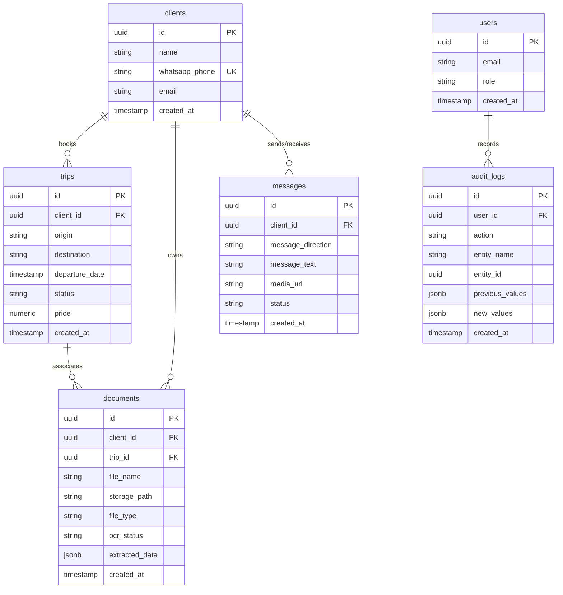

# Modelo de Base de Datos (Supabase / PostgreSQL)

Este documento detalla la estructura física de la base de datos PostgreSQL hospedada en Supabase, incluyendo tipos de datos, relaciones, índices y políticas de seguridad a nivel de fila (Row Level Security - RLS).

---

## 1. Diagrama de Relaciones de Entidades (ERD)



---

## 2. Especificación de Tablas

### 2.1 Tabla `users` (Gestión de Administradores)
Esta tabla se sincroniza con la autenticación nativa de Supabase (`auth.users`).

| Columna | Tipo | Restricción | Descripción |
| :--- | :--- | :--- | :--- |
| `id` | `UUID` | PK, References `auth.users(id)` | Identificador único del usuario / administrador. |
| `email` | `VARCHAR(255)` | UNIQUE, NOT NULL | Correo electrónico de acceso. |
| `role` | `VARCHAR(50)` | DEFAULT 'operator' | Rol en la plataforma: `admin`, `operator`. |
| `created_at` | `TIMESTAMPTZ` | DEFAULT NOW() | Fecha de registro. |

### 2.2 Tabla `clients`
Registra los clientes que interactúan a través de WhatsApp.

| Columna | Tipo | Restricción | Descripción |
| :--- | :--- | :--- | :--- |
| `id` | `UUID` | PK, DEFAULT uuid_generate_v4() | Identificador de cliente. |
| `name` | `VARCHAR(255)` | NULL | Nombre del cliente (puede extraerse vía IA). |
| `whatsapp_phone` | `VARCHAR(50)` | UNIQUE, NOT NULL | Número de teléfono de WhatsApp formateado con código de país. |
| `email` | `VARCHAR(255)` | UNIQUE, NULL | Correo electrónico del cliente. |
| `created_at` | `TIMESTAMPTZ` | DEFAULT NOW() | Fecha de primer contacto. |

### 2.3 Tabla `trips` (Viajes / Trayectos)
Representa los viajes solicitados por los clientes y procesados por el operador o por automatización.

| Columna | Tipo | Restricción | Descripción |
| :--- | :--- | :--- | :--- |
| `id` | `UUID` | PK, DEFAULT uuid_generate_v4() | Identificador de viaje. |
| `client_id` | `UUID` | FK, References `clients(id)` | Cliente asociado al viaje. |
| `origin` | `VARCHAR(255)` | NOT NULL | Ciudad / Lugar de origen del trayecto. |
| `destination` | `VARCHAR(255)` | NOT NULL | Ciudad / Lugar de destino del trayecto. |
| `departure_date` | `TIMESTAMPTZ` | NULL | Fecha y hora planificada de salida. |
| `status` | `VARCHAR(50)` | DEFAULT 'pending' | Estado: `pending`, `confirmed`, `completed`, `cancelled`. |
| `price` | `NUMERIC(10, 2)` | NULL | Costo acordado del viaje. |
| `created_at` | `TIMESTAMPTZ` | DEFAULT NOW() | Fecha de registro. |

### 2.4 Tabla `documents` (OCR y Almacenamiento)
Archivos subidos por los clientes (PDF, PNG, JPG) que contienen pasaportes, contratos o tickets.

| Columna | Tipo | Restricción | Descripción |
| :--- | :--- | :--- | :--- |
| `id` | `UUID` | PK, DEFAULT uuid_generate_v4() | Identificador de documento. |
| `client_id` | `UUID` | FK, References `clients(id)` | Dueño del documento. |
| `trip_id` | `UUID` | FK, References `trips(id)`, NULL | Viaje al que está asociado. |
| `file_name` | `VARCHAR(255)` | NOT NULL | Nombre original del archivo. |
| `storage_path` | `TEXT` | NOT NULL | Ruta de almacenamiento en Supabase Storage bucket. |
| `file_type` | `VARCHAR(100)` | NOT NULL | MIME Type (p. ej., `application/pdf`, `image/png`). |
| `ocr_status` | `VARCHAR(50)` | DEFAULT 'pending' | Estado de análisis: `pending`, `processing`, `success`, `failed`. |
| `extracted_data` | `JSONB` | DEFAULT '{}' | Parámetros extraídos por la IA (p. ej., DNI, nombre, fecha exp). |
| `created_at` | `TIMESTAMPTZ` | DEFAULT NOW() | Fecha de subida. |

### 2.5 Tabla `messages` (Historial de Mensajes)
Historial completo de mensajes entrantes y salientes vía WhatsApp.

| Columna | Tipo | Restricción | Descripción |
| :--- | :--- | :--- | :--- |
| `id` | `UUID` | PK, DEFAULT uuid_generate_v4() | Identificador de mensaje interno. |
| `client_id` | `UUID` | FK, References `clients(id)` | Cliente involucrado. |
| `message_direction` | `VARCHAR(20)` | CHECK (in ('inbound', 'outbound')) | Dirección del mensaje. |
| `message_text` | `TEXT` | NULL | Contenido de texto del mensaje. |
| `media_url` | `TEXT` | NULL | URL del archivo adjunto si existiese. |
| `status` | `VARCHAR(50)` | DEFAULT 'sent' | Estado de entrega: `sent`, `delivered`, `read`, `failed`. |
| `created_at` | `TIMESTAMPTZ` | DEFAULT NOW() | Fecha de recepción o envío. |

### 2.6 Tabla `audit_logs`
Bitácora de auditoría detallada de todos los cambios de estado críticos e interacciones de IA.

| Columna | Tipo | Restricción | Descripción |
| :--- | :--- | :--- | :--- |
| `id` | `UUID` | PK, DEFAULT uuid_generate_v4() | Identificador de log. |
| `user_id` | `UUID` | FK, References `users(id)`, NULL | Operador humano responsable. Nulo si es automatización de IA. |
| `action` | `VARCHAR(100)` | NOT NULL | Tipo de acción: `CREATE_TRIP`, `OCR_EXTRACT`, `IA_REPLY`, etc. |
| `entity_name` | `VARCHAR(100)` | NOT NULL | Nombre de tabla modificada (p. ej., `trips`, `documents`). |
| `entity_id` | `UUID` | NOT NULL | ID de la entidad afectada. |
| `previous_values` | `JSONB` | NULL | Valores anteriores al cambio. |
| `new_values` | `JSONB` | NULL | Nuevos valores post-cambio. |
| `created_at` | `TIMESTAMPTZ` | DEFAULT NOW() | Instante de la auditoría. |

---

## 3. Scripts de Inicialización SQL (Supabase Migrations)

```sql
-- Habilitar extensión UUID
CREATE EXTENSION IF NOT EXISTS "uuid-ossp";

-- Tabla de Usuarios Administradores
CREATE TABLE public.users (
    id UUID PRIMARY KEY REFERENCES auth.users(id) ON DELETE CASCADE,
    email VARCHAR(255) UNIQUE NOT NULL,
    role VARCHAR(50) DEFAULT 'operator' CHECK (role IN ('admin', 'operator')),
    created_at TIMESTAMPTZ DEFAULT NOW() NOT NULL
);

-- Tabla de Clientes
CREATE TABLE public.clients (
    id UUID PRIMARY KEY DEFAULT uuid_generate_v4(),
    name VARCHAR(255),
    whatsapp_phone VARCHAR(50) UNIQUE NOT NULL,
    email VARCHAR(255) UNIQUE,
    created_at TIMESTAMPTZ DEFAULT NOW() NOT NULL
);

-- Tabla de Viajes
CREATE TABLE public.trips (
    id UUID PRIMARY KEY DEFAULT uuid_generate_v4(),
    client_id UUID REFERENCES public.clients(id) ON DELETE CASCADE NOT NULL,
    origin VARCHAR(255) NOT NULL,
    destination VARCHAR(255) NOT NULL,
    departure_date TIMESTAMPTZ,
    status VARCHAR(50) DEFAULT 'pending' CHECK (status IN ('pending', 'confirmed', 'completed', 'cancelled')) NOT NULL,
    price NUMERIC(10, 2),
    created_at TIMESTAMPTZ DEFAULT NOW() NOT NULL
);

-- Tabla de Documentos
CREATE TABLE public.documents (
    id UUID PRIMARY KEY DEFAULT uuid_generate_v4(),
    client_id UUID REFERENCES public.clients(id) ON DELETE CASCADE NOT NULL,
    trip_id UUID REFERENCES public.trips(id) ON DELETE SET NULL,
    file_name VARCHAR(255) NOT NULL,
    storage_path TEXT NOT NULL,
    file_type VARCHAR(100) NOT NULL,
    ocr_status VARCHAR(50) DEFAULT 'pending' CHECK (ocr_status IN ('pending', 'processing', 'success', 'failed')) NOT NULL,
    extracted_data JSONB DEFAULT '{}'::jsonb NOT NULL,
    created_at TIMESTAMPTZ DEFAULT NOW() NOT NULL
);

-- Tabla de Mensajes
CREATE TABLE public.messages (
    id UUID PRIMARY KEY DEFAULT uuid_generate_v4(),
    client_id UUID REFERENCES public.clients(id) ON DELETE CASCADE NOT NULL,
    message_direction VARCHAR(20) CHECK (message_direction IN ('inbound', 'outbound')) NOT NULL,
    message_text TEXT,
    media_url TEXT,
    status VARCHAR(50) DEFAULT 'sent' CHECK (status IN ('sent', 'delivered', 'read', 'failed')) NOT NULL,
    created_at TIMESTAMPTZ DEFAULT NOW() NOT NULL
);

-- Tabla de Auditoría
CREATE TABLE public.audit_logs (
    id UUID PRIMARY KEY DEFAULT uuid_generate_v4(),
    user_id UUID REFERENCES public.users(id) ON DELETE SET NULL,
    action VARCHAR(100) NOT NULL,
    entity_name VARCHAR(100) NOT NULL,
    entity_id UUID NOT NULL,
    previous_values JSONB,
    new_values JSONB,
    created_at TIMESTAMPTZ DEFAULT NOW() NOT NULL
);

-- Crear Índices para Optimizar Búsquedas
CREATE INDEX idx_clients_whatsapp ON public.clients(whatsapp_phone);
CREATE INDEX idx_trips_client ON public.trips(client_id);
CREATE INDEX idx_documents_client ON public.documents(client_id);
CREATE INDEX idx_messages_client ON public.messages(client_id);
CREATE INDEX idx_audit_entity ON public.audit_logs(entity_name, entity_id);

-- Configuración de Row Level Security (RLS)
ALTER TABLE public.users ENABLE ROW LEVEL SECURITY;
ALTER TABLE public.clients ENABLE ROW LEVEL SECURITY;
ALTER TABLE public.trips ENABLE ROW LEVEL SECURITY;
ALTER TABLE public.documents ENABLE ROW LEVEL SECURITY;
ALTER TABLE public.messages ENABLE ROW LEVEL SECURITY;
ALTER TABLE public.audit_logs ENABLE ROW LEVEL SECURITY;

-- Políticas base: Solo personal autenticado de Supabase puede leer y escribir
CREATE POLICY "Permitir todo a usuarios autenticados" ON public.clients
    FOR ALL USING (auth.role() = 'authenticated');

CREATE POLICY "Permitir todo a usuarios autenticados" ON public.trips
    FOR ALL USING (auth.role() = 'authenticated');

CREATE POLICY "Permitir todo a usuarios autenticados" ON public.documents
    FOR ALL USING (auth.role() = 'authenticated');

CREATE POLICY "Permitir todo a usuarios autenticados" ON public.messages
    FOR ALL USING (auth.role() = 'authenticated');

CREATE POLICY "Permitir todo a usuarios autenticados" ON public.audit_logs
    FOR ALL USING (auth.role() = 'authenticated');
```
