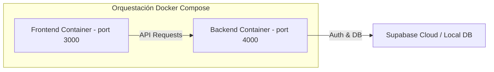

# Infraestructura, Docker y CI/CD

Este documento describe la configuración de despliegue, la contenedorización mediante Docker y los flujos de integración y despliegue continuos (CI/CD) para los entornos de desarrollo y producción.

---

## 1. Contenedores con Docker

El proyecto se distribuye en múltiples contenedores coordinados para simplificar la ejecución en local y en la nube.



### Dockerfile del Backend (`/backend/Dockerfile`)
Un contenedor multilinea (Multi-stage build) que minimiza el tamaño de la imagen final compilando el código TypeScript y removiendo las dependencias de desarrollo.

```dockerfile
# Stage 1: Build
FROM node:20-alpine AS builder
WORKDIR /usr/src/app
COPY package*.json ./
RUN npm ci
COPY . .
RUN npm run build

# Stage 2: Runtime
FROM node:20-alpine AS runner
WORKDIR /usr/src/app
COPY package*.json ./
RUN npm ci --only=production
COPY --from=builder /usr/src/app/dist ./dist
EXPOSE 4000
ENV NODE_ENV=production
CMD ["node", "dist/app.js"]
```

### Dockerfile del Frontend (`/Dockerfile` en raíz o `/frontend/Dockerfile`)
Optimizado para compilar Next.js en producción.

```dockerfile
# Stage 1: Build
FROM node:20-alpine AS builder
WORKDIR /app
COPY package*.json ./
RUN npm ci
COPY . .
RUN npm run build

# Stage 2: Runtime
FROM node:20-alpine AS runner
WORKDIR /app
ENV NODE_ENV=production
COPY --from=builder /app/public ./public
COPY --from=builder /app/.next/standalone ./
COPY --from=builder /app/.next/static ./.next/static
EXPOSE 3000
CMD ["node", "server.js"]
```

---

## 2. Pipeline de CI/CD (GitHub Actions)

El flujo automatizado asegura que el código subido pase las validaciones antes de compilarse e implementarse.

### Ubicación del archivo: `.github/workflows/ci-cd.yml`

```yaml
name: CI/CD Pipeline

on:
  push:
    branches: [ main, develop ]
  pull_request:
    branches: [ main ]

jobs:
  lint-and-test:
    runs-on: ubuntu-latest
    steps:
      - name: Checkout Code
        uses: actions/checkout@v4

      - name: Setup Node.js
        uses: actions/setup-node@v4
        with:
          node-version: 20
          cache: 'npm'

      - name: Install Frontend Deps
        run: npm ci

      - name: Lint Frontend
        run: npm run lint

      - name: Build Frontend
        run: npm run build

      - name: Install Backend Deps
        run: |
          cd backend
          npm ci

      - name: Build Backend
        run: |
          cd backend
          npm run build

  deploy-production:
    needs: lint-and-test
    if: github.ref == 'refs/heads/main' && github.event_name == 'push'
    runs-on: ubuntu-latest
    steps:
      - name: Trigger Deploy
        run: |
          echo "Ejecutando scripts de despliegue en Vercel (Frontend) y Render/Railway/ECS (Backend)..."
          # Aquí se integran los CLI de Vercel y Railway o comandos docker push
```

---

## 3. Checklist de Despliegue en Producción

Antes de lanzar el sistema a producción, verifique que se cumplan las siguientes tareas críticas:

### 3.1 Base de Datos (Supabase)
- [ ] Aplicar todas las migraciones SQL en la base de datos de producción.
- [ ] Asegurar que las políticas RLS estén habilitadas en todas las tablas públicas.
- [ ] Modificar las contraseñas por defecto y tokens JWT de Supabase.
- [ ] Configurar respaldos automáticos diarios.

### 3.2 Backend
- [ ] Configurar variables de entorno reales en la plataforma de hosting (`SUPABASE_URL`, `SUPABASE_SERVICE_ROLE_KEY`, `WHATSAPP_ACCESS_TOKEN`, `GEMINI_API_KEY`).
- [ ] Activar compresión gzip (o Brotli) y configurar middleware `helmet` para cabeceras de seguridad.
- [ ] Monitoreo de logs activo (p. ej., Datadog, BetterStack, o AWS CloudWatch).

### 3.3 WhatsApp Business API
- [ ] Verificar el número de teléfono corporativo en la cuenta de Meta Business Manager.
- [ ] Modificar la URL del webhook en la app de Meta por la URL HTTPS de producción.
- [ ] Configurar alertas de uso/costo en Meta Developers.

### 3.4 Frontend (Next.js)
- [ ] Validar variables de entorno públicas (`NEXT_PUBLIC_SUPABASE_URL`, `NEXT_PUBLIC_SUPABASE_ANON_KEY`).
- [ ] Confirmar compatibilidad HTTPS.
- [ ] Optimizar imágenes y fuentes para carga ultrarrápida.
