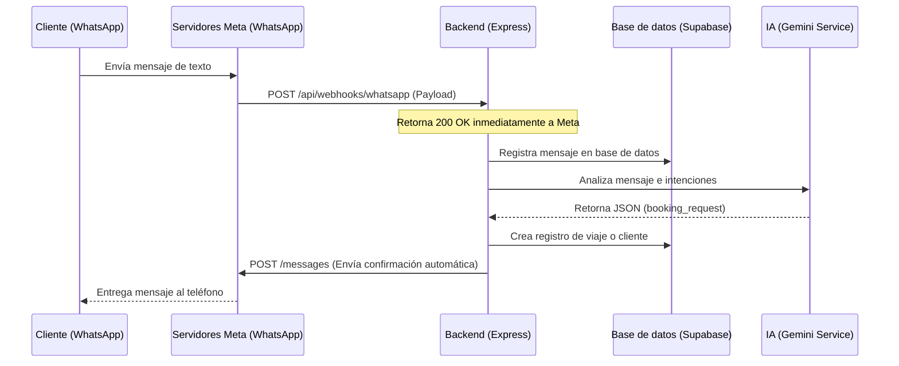

# Guía de Integraciones (WhatsApp Cloud API y n8n)

Este documento detalla la integración con servicios externos para el envío y recepción de mensajes de WhatsApp y la orquestación de tareas en segundo plano a través de n8n.

---

## 1. Integración con WhatsApp Cloud API

El sistema utiliza la API oficial de WhatsApp Cloud de Meta. Esto garantiza estabilidad, cumplimiento normativo y evita bloqueos de números asociados a prácticas de web scraping.

### 1.1 Diagrama de Recepción de Mensaje (Webhook)



### 1.2 Configuración del Webhook en Meta Business Suite
1. Registrarse como desarrollador en [Meta Developers](https://developers.facebook.com/).
2. Crear una App de tipo "Business".
3. Agregar el producto **WhatsApp** a la App.
4. En **Configuración de WhatsApp > Webhooks**:
   - URL de retorno: `https://tu-dominio.com/api/webhooks/whatsapp`
   - Token de verificación: Definido por la variable de entorno `WHATSAPP_VERIFY_TOKEN`.
5. Suscribirse al campo de webhook `messages`.

### 1.3 Envío de Mensaje (Request de Salida)
Para enviar un mensaje desde el backend de Express a un cliente, se realiza una petición HTTP POST a los servidores de Meta:

* **URL:** `https://graph.facebook.com/v20.0/{{WHATSAPP_PHONE_NUMBER_ID}}/messages`
* **Headers:**
  - `Authorization: Bearer {{WHATSAPP_ACCESS_TOKEN}}`
  - `Content-Type: application/json`
* **Body:**
  ```json
  {
    "messaging_product": "whatsapp",
    "recipient_type": "individual",
    "to": "+34600112233",
    "type": "text",
    "text": {
      "preview_url": false,
      "body": "Hola, tu viaje de Madrid a Valencia ha sido confirmado por un operador."
    }
  }
  ```

---

## 2. Integración con n8n (Orquestación de Flujos)

Para evitar sobrecargar el backend de Express con flujos de trabajo asíncronos complejos y automatizaciones comerciales (como notificaciones por correo, sincronización con hojas de cálculo o alertas en Slack), delegamos en un flujo de **n8n**.

### 2.1 Puntos de Integración (Triggers)
El backend invoca a n8n mediante HTTP Webhooks en eventos clave del ciclo de vida:

1. **`trip.created`**: Se dispara cuando se registra una solicitud de viaje.
   * *Acción n8n:* Agrega una fila en un Google Sheet de control interno y envía una alerta al canal de Telegram/Slack de los operadores.
2. **`trip.confirmed`**: Se dispara al confirmar un viaje.
   * *Acción n8n:* Genera una plantilla de factura en PDF usando un servicio externo, la sube a Supabase Storage y envía una plantilla de correo electrónico vía SendGrid/Nodemailer al cliente.
3. **`ocr.failed`**: Se dispara si el OCR falla recurrentemente.
   * *Acción n8n:* Crea una tarea de revisión urgente en Trello u Notion para que un operador revise manualmente.

### 2.2 Ejemplo de Estructura de Payload enviado a n8n
```json
{
  "event": "trip.confirmed",
  "timestamp": "2026-07-03T19:15:00Z",
  "data": {
    "trip_id": "8f8e8d8c-8b8a-8f8e-8d8c-8b8a8f8e8d8c",
    "client": {
      "name": "Juan Perez",
      "email": "juan.perez@email.com",
      "phone": "+34600112233"
    },
    "details": {
      "origin": "Madrid",
      "destination": "Valencia",
      "departure_date": "2026-07-04T18:00:00Z",
      "price": 120.00
    }
  }
}
```
*Las URLs de los webhooks de n8n se configuran en el archivo `.env` del backend para desacoplar el entorno local de producción.*
