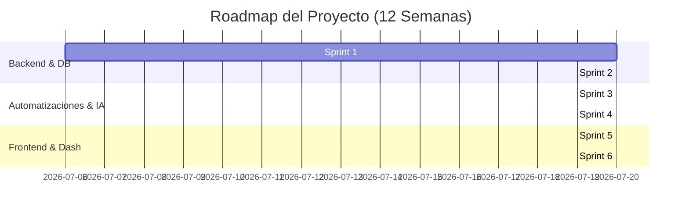

# Roadmap de Desarrollo y Sprints

Este documento establece el plan de ejecución temporal del proyecto distribuido en **6 Sprints** de 2 semanas cada uno (12 semanas en total), enfocado en una metodología ágil para garantizar entregas incrementales y funcionales de la plataforma de automatización.

---

## 1. Visión General del Roadmap

---

## 2. Detalle de Sprints

### Sprint 1: Fundaciones y Modelo de Datos (Semanas 1-2)
* **Objetivo:** Configurar los entornos locales, base de datos en Supabase y esqueletos de los proyectos con TypeScript.
* **Entregables:**
  - Estructura base de Next.js y Express en monorepo.
  - Esquema de base de datos SQL creado en Supabase con RLS básico.
  - Dockerización local funcional.
  - Endpoints de prueba `/api/health`.

### Sprint 2: Autenticación e Integración de WhatsApp Webhook (Semanas 3-4)
* **Objetivo:** Implementar la autenticación de usuarios y la recepción y persistencia de mensajes de WhatsApp.
* **Entregables:**
  - Login y control de acceso de operadores integrado con Supabase Auth.
  - Endpoint de validación y recepción de Webhooks de WhatsApp Cloud API.
  - Persistencia de mensajes entrantes (`messages`) y vinculación/creación automática de clientes (`clients`).

### Sprint 3: Almacenamiento y Motor OCR con IA (Semanas 5-6)
* **Objetivo:** Permitir la subida de archivos multimedia de WhatsApp, su almacenamiento y procesamiento OCR automático mediante Gemini Vision.
* **Entregables:**
  - Descarga automática de adjuntos multimedia desde webhooks de WhatsApp.
  - Subida a Supabase Storage Bucket configurado.
  - Servicio `ocr.service.ts` conectado a Gemini Vision API.
  - Extracción y guardado de parámetros estructurados en la tabla `documents`.

### Sprint 4: Inteligencia de Negocio y Respuestas Automáticas (Semanas 7-8)
* **Objetivo:** Lógica de clasificación de intenciones de viaje y respuestas asistidas e integraciones externas.
* **Entregables:**
  - Clasificación inteligente de solicitudes de viajes (`BOOKING_REQUEST` vs `GENERAL_INQUIRY`).
  - Creación automática de viajes (`trips`) en estado pendiente.
  - Envío automático de respuestas prediseñadas/contextuales por WhatsApp Cloud API.
  - Publicación de webhooks a n8n para flujos asíncronos comerciales (facturación, notificaciones en Slack).

### Sprint 5: Dashboard e Interfaz de Chat Interactiva (Semanas 9-10)
* **Objetivo:** Desarrollar el frontend de Next.js para los operadores.
* **Entregables:**
  - Dashboard interactivo con estadísticas de viajes, documentos y mensajes.
  - Módulo de visualización, edición y confirmación manual de viajes (`/trips`).
  - Módulo de chat tipo WhatsApp Web para interacción en vivo y respuestas manuales con soporte de plantillas (`/chats`).

### Sprint 6: Pruebas, Auditoría y Despliegue (Semanas 11-12)
* **Objetivo:** Asegurar la robustez del sistema, logs de auditoría completos y desplegar en producción.
* **Entregables:**
  - Registro automático de logs en `audit_logs` para acciones críticas (aprobaciones, fallos de OCR, etc.).
  - Pruebas unitarias y de integración para controladores y servicios críticos en backend.
  - Configuración de pipelines CI/CD (GitHub Actions).
  - Despliegue de producción y checklist final completado.
